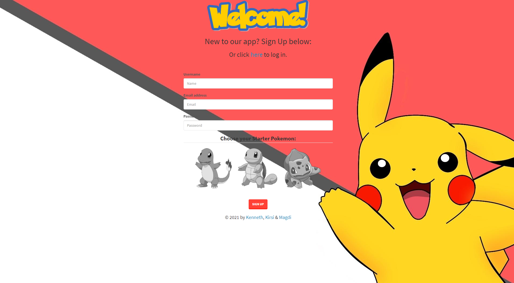
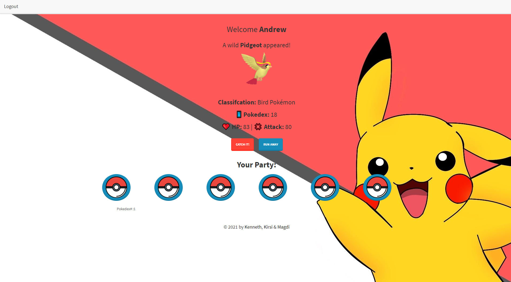

# Pokemon STAY

An interactive API web app built using MySQL, Node.js, Express, Sequelize and Handlebars.

## Description 

* [Github Repository](https://github.com/kirsralk/Group4-Project2).
* [Deployed on Heroku](https://group4-project2.herokuapp.com/).

Pokemon STAY makes databases fun! Users can select their starter Pokemon from the traditional choices of Bulbasaur, Charmander or Squirtle.  Upon creating their account, users are then taken to the members page where random "wild" Pokemon appear from our database.  Future versions will allow users to add wild Pokemon to their party of 6 and leverage attack/defense/HP stats to enable battles.

* App Screenshots:




## User Story

```
As a Pokemon fan
I want to be able to collect and battle Pokemon online
So that I can enjoy Pokemon from anywhere.
Gotta catch 'em all!
```

## Installation

This app is deployed on Heroku and can be accessed from your browser at https://group4-project2.herokuapp.com/.  


## Credits

Contributors:
* Kenneth: https://github.com/Ezkenneth
* Kirsi: https://github.com/kirsralk/
* Magdi: https://github.com/ttmgs/

Pokemon database created using [The Complete Pokemon Dataset](https://www.kaggle.com/rounakbanik/pokemon).  
Pokemon images by [Pokemon Database](https://pokemondb.net/sprites).  


## License

[](https://opensource.org/licenses/MIT)